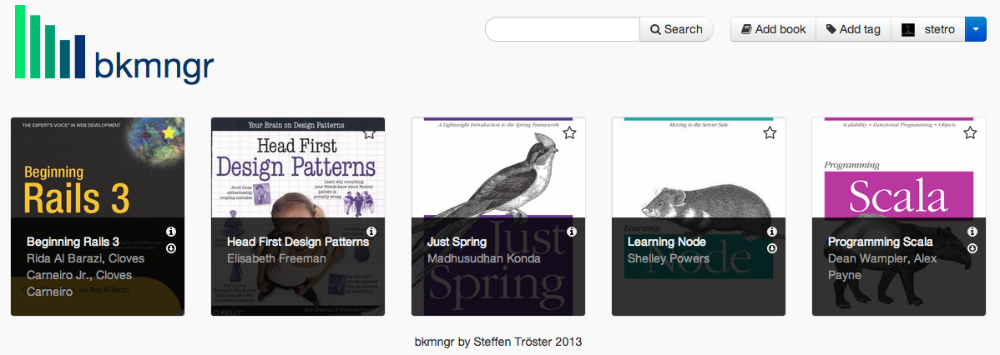
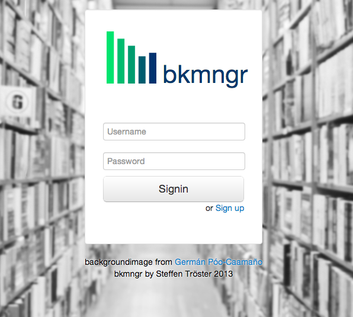

 bkmngr
====================================================================================

NodeJS Book Management CMS based on LocomotiveJS and AngularJS.

## Installation

1. Install all depenencies with 'npm install'
2. Edit '/config/initializers/01_mongooose.js' with your mongodb setup
3. Install locomotive via 'npm install -g locomotive'
4. Run the locomotive server with lcm server

> Be sure to run locomotive 3.x
